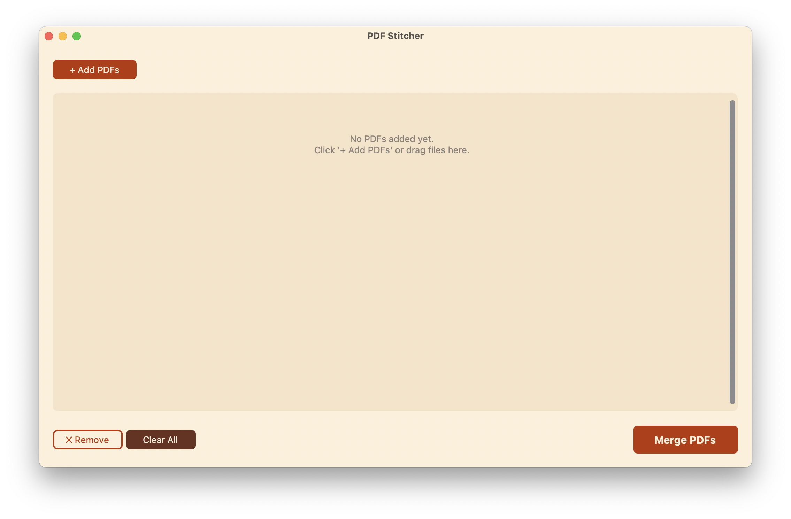
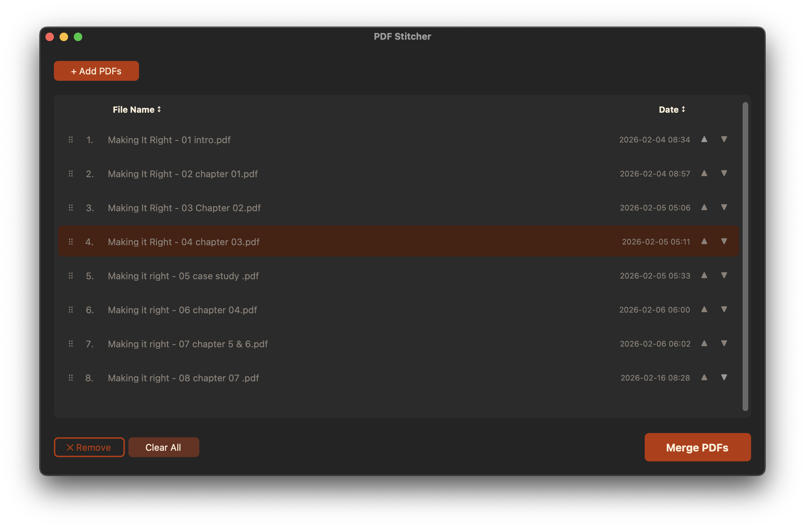

# PDF Stitcher

A native macOS desktop app to merge PDF files with a modern, intuitive interface.


## Features

- **Modern UI** - Built with CustomTkinter with a warm cream and rust color palette, adapts to macOS dark/light mode
- **Easy File Management** - Add multiple PDFs with native file picker
- **Drag & Drop** - Drag PDF files from Finder directly into the app
- **Flexible Ordering** - Drag to reorder files, or use inline arrow buttons on each row
- **Smart Sorting** - Click "File Name" or "Date" column headers to sort
- **Native Integration** - Uses macOS native file dialogs and transparent title bar
- **Simple & Fast** - All features in one clean interface

## Screenshots

| Light Mode | Dark Mode |
|:---:|:---:|
|  |  |

## Requirements

- macOS 10.14 or later
- Python 3.12 from [python.org](https://www.python.org/downloads/release/python-3128/) (includes Tcl/Tk 8.6, required for drag-and-drop support)

> **Note:** Homebrew Python ships with Tcl 9, which is incompatible with `tkinterdnd2`. Use the official python.org installer instead.

## Installation

### 1. Install Python 3.12

Download and install from [python.org](https://www.python.org/downloads/release/python-3128/).

### 2. Clone the Repository

```bash
git clone https://github.com/inquotes/PDFMerger.git
cd PDFMerger
```

### 3. Set Up Virtual Environment

```bash
python3.12 -m venv venv
source venv/bin/activate
pip install -r requirements.txt
```

## Usage

### Running the App

```bash
source venv/bin/activate
python main.py
```

### Using the App

1. **Add PDFs** - Click "+ Add PDFs" or drag files from Finder into the app
2. **Reorder** - Drag files by the grip icon (⠿) to reorder, or use the arrow buttons on each row
3. **Sort** - Click the "File Name" or "Date" column headers to sort
4. **Remove** - Select a file and click "Remove", or "Clear All" to start over
5. **Merge** - Click "Merge PDFs" and choose where to save the result

## Building as a .app

### For Development

The pre-built app is available in the `dist/` folder after running:

```bash
source venv/bin/activate
pip install pyinstaller
pyinstaller --name="PDF Stitcher" --windowed --icon=icon.icns main.py
```

The app will be created at `dist/PDF Stitcher.app`

### For Distribution

**Simple sharing (friends/family):**
```bash
cd dist
zip -r "PDF Stitcher.zip" "PDF Stitcher.app"
```
Recipients: Right-click → Open on first launch to bypass Gatekeeper.

**Code signing (optional, requires Apple Developer account):**
```bash
codesign --deep --force --verify --verbose --sign "Developer ID Application: YourName" "PDF Stitcher.app"
```

**Notarization (optional, for wider distribution):**
```bash
xcrun notarytool submit "PDF Stitcher.zip" --apple-id <email> --password <app-password> --team-id <team-id>
```

## Dependencies

- [CustomTkinter](https://github.com/TomSchimansky/CustomTkinter) - Modern UI framework
- [pypdf](https://github.com/py-pdf/pypdf) - PDF manipulation library
- [tkinterdnd2](https://github.com/pmgagne/tkinterdnd2) - Drag-and-drop support for Tkinter

## Development

### Project Structure

```
PDFMerger/
├── main.py           # Main application code
├── requirements.txt  # Python dependencies
├── icon.icns         # App icon
├── setup.py          # py2app configuration (legacy)
├── venv/             # Virtual environment (not in git)
├── build/            # Build artifacts (not in git)
├── dist/             # Built .app bundle (not in git)
└── README.md         # This file
```

### Contributing

Contributions welcome! Please feel free to submit a Pull Request.

## License

MIT License - feel free to use this project however you'd like.

## Roadmap

- [x] Package as standalone .app
- [x] Add drag-and-drop support
- [ ] Page range selection for individual PDFs
- [ ] PDF preview thumbnails
- [ ] Remember last used directory
- [ ] Batch processing presets

## Author

Built with ❤️ for macOS

---

*If you find this useful, consider giving it a ⭐ on GitHub!*
